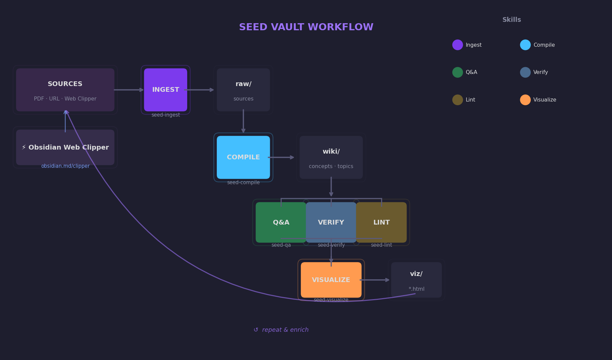

# Seed Vault

[](https://github.com/JonChan0/Seed-Vault/actions/workflows/ci.yml)

A portable, LLM-powered personal knowledge wiki framework. Use this repo as a **GitHub template** — each wiki is a fresh instance that lives entirely on your local machine. Your raw sources, compiled articles, and visualizations are never pushed to GitHub.

---

## Starting a New Wiki

The framework installs **into any empty directory** with one command — no fork, no
template, no git history required. Pick a version-pinned, content-free install.

### Install with `bootstrap.sh` (recommended)

```bash
# Latest release, fresh vault at ~/genomics-wiki
curl -fsSL https://raw.githubusercontent.com/JonChan0/Seed-Vault/main/bootstrap.sh \
  | bash -s -- new ~/genomics-wiki

# …or pin an exact version
curl -fsSL .../bootstrap.sh | bash -s -- new ~/genomics-wiki --version v3.0.0
```

This lays down the framework (`_vault/`, `_templates/`, configs), templates the README
to your vault name, creates the empty `wiki/` skeleton, and records the version in
`.vault_version`. The directory becomes a standalone vault you back up however you like.

> Prefer a clone? `git clone https://github.com/JonChan0/Seed-Vault my-wiki && cd my-wiki && bash _vault/install.sh` still works, but you then carry the framework's git history.

### Dependencies
```bash
# Install Python dependencies (requires uv)
uv sync

# Install qmd for search indexing
npm install -g @tobilu/qmd

# (bootstrap.sh runs _vault/install.sh for you; run it manually only after a clone)
bash _vault/install.sh

# Open as an Obsidian vault
# Obsidian → File → Open Vault → select this folder
```

Then in **Claude Code**, open the folder — skills in `.claude/skills/` are auto-loaded, no `/reload-plugins` needed.

Or in **Antigravity CLI**, run `agy` in the folder — `AGENTS.md` and `.agents/skills/` are auto-loaded.

---

## What Stays on GitHub vs. What Stays Local

| | GitHub (the template) | Your local wiki |
|--|----------------------|--------------------|
| `_vault/` skills & engines | ✅ tracked | ✅ tracked |
| `CLAUDE.md`, `AGENTS.md`, `_templates/`, `.obsidian/` | ✅ tracked | ✅ tracked |
| `pyproject.toml` | ✅ tracked | ✅ tracked |
| `.claude/skills/` Claude project skills | ❌ gitignored | generated by install.sh |
| `.agents/skills/` Antigravity project skills | ❌ gitignored | generated by install.sh |
| `raw/` source documents | ❌ gitignored | local only |
| `wiki/` compiled articles | ❌ gitignored | local only |
| `viz/` visualizations | ❌ gitignored | local only |
| `outputs/` reports | ❌ gitignored | local only |

**Wiki content is deliberately not tracked.** Your notes, source documents, and compiled articles can be large, private, or both. Keep them local (or back them up separately with your own approach — e.g. a private git repo, Obsidian Sync, or a local backup).

---

## Updating Your Vault

From inside your vault, run `bootstrap.sh update` to pull a new framework version without touching your content.

```bash
# Latest release
bash bootstrap.sh update

# Pin to a specific release
bash bootstrap.sh update --version v3.0.0

# Preview only — writes nothing, skips migrations and index rebuild
bash bootstrap.sh update --dry-run

# Install from a local framework checkout instead of fetching a release
bash bootstrap.sh update --source-dir ~/path/to/Seed-Vault
```

### What `update` does

1. Fetches the framework tarball from GitHub (or uses `--source-dir` for a local checkout).
2. Overwrites **only** the paths listed in `_vault/manifest.txt` — this never touches `wiki/`, `raw/`, `viz/`, `outputs/`, or `.vault_version`. Content safety is structural.
3. Re-runs `_vault/install.sh` — re-links skills, runs `uv sync`, checks dependencies.
4. Runs `_vault/migrate.py` to apply article migrations when the framework version has bumped.
5. Rebuilds the search index.

### Version files

| File | Tracked? | Records |
|------|----------|---------|
| `_vault/VERSION` | ✅ tracked | Framework version (what the installed engines and skills are) |
| `.vault_version` | ❌ gitignored | Article version (what your wiki content has been migrated to) |

### `requires_llm` migrations

Some migrations have a semantic step that deterministic code can't handle alone. When `migrate.py` encounters one, it runs the structural part but **holds `.vault_version` back** at the pre-migration version — so a half-finished update can never look complete to the next `update` run.

To finish the manual step, invoke `vault-migrate` in Claude Code or Antigravity CLI. It performs the LLM reasoning step and then calls:

```bash
uv run python _vault/migrate.py --complete
```

…which advances `.vault_version` to confirm the migration is done.

### Standalone migrate commands

```bash
# Preview pending migrations — writes nothing
uv run python _vault/migrate.py --dry-run

# Run migrations directly (without going through bootstrap.sh update)
uv run python _vault/migrate.py

# Finalize a held-back requires_llm migration (after the LLM step is done)
uv run python _vault/migrate.py --complete
```

See [docs/Updating-Your-Vault.md](docs/Updating-Your-Vault.md) for the full guide.

---

## LLM Frontend Support

Seed Vault works with **Claude Code** or **Antigravity CLI** (`agy`) as the LLM frontend. Both use the same skills, Python engines, and wiki format. See [docs/LLM-Frontends.md](docs/LLM-Frontends.md) for a full comparison.

---

## How It Works

```
raw/      ← you drop sources here
wiki/     ← your LLM writes everything here (concepts, sources, visualizations)
viz/      ← self-contained HTML visualizations
outputs/  ← Q&A reports, lint reports, one-offs
```

The LLM is the primary author of all files in `wiki/`, `viz/`, and `outputs/`. Deterministic Python engines in `_vault/lib/` handle structural tasks (indexing, linting, claim extraction) while the LLM handles synthesis and reasoning. See [docs/Architecture.md](docs/Architecture.md) for the full directory reference and engine breakdown.

---

## Skills

The vault ships ten skills. Nine are **single-purpose skills** that each own one
operation; the tenth, `vault-pipeline`, is a **meta-skill** that orchestrates the
others end-to-end.

### Single-purpose skills

<!-- SKILLS:START -->
| Skill Name | Say this... | The LLM will... |
|------------|-------------|-----------------|
| `vault-ingest` | "Ingest raw/paper.pdf" / "import this URL" | Run convert.py for file conversion, then create source summary in wiki/sources/; supports YouTube transcripts and Wayback Machine fallback for dead URLs |
| `vault-compile` | "Compile the wiki" / "write an article about X" | Build interconnected concept articles from raw sources |
| `vault-index` | "Reindex" / "rebuild index" | Run index.py to rebuild _index.md and qmd search index; fully deterministic |
| `vault-qa` | "What do we know about X?" / "research X" | Use qmd for retrieval, then synthesize an answer with citations and confidence rating |
| `vault-verify` | "Fact-check the X article" / "verify this" | Run verify.py for claim extraction, then launch clean-context subagent for unbiased semantic verification |
| `vault-lint` | "Check the wiki health" / "lint" | Run lint.py for 7 structural checks, then review complex issues and suggest fixes |
| `vault-visualize` | "Visualize X as a chart" / "map out X" | Generate self-contained HTML chart/diagram + Obsidian wrapper page |
| `vault-digest` | "Briefing" / "what's in the wiki?" | Run digest.py for fully deterministic vault status summary |
| `vault-migrate` | "Migrate my wiki" / "apply updates" | Run migrate.py for structural changes, handle LLM migration steps if needed |
<!-- SKILLS:END -->

### Meta-skill

`vault-pipeline` doesn't do new work of its own — it sequences the single-purpose
skills above into one pass, so you can process everything with a single request.

| Skill Name | Say this... | The LLM will... |
|------------|-------------|-----------------|
| `vault-pipeline` | "Process everything" / "run the pipeline" | Run pipeline.py to detect new/changed files, then orchestrate `vault-ingest` → `vault-compile` → `vault-index` → `vault-verify` (clean-context subagent) → `vault-lint` in one pass |

---

## Obsidian Setup

Open as a vault: Obsidian → File → Open Vault → select this folder. The vault is pre-configured with graph view colors (Concepts: blue, Sources: green, Viz: orange), templates in `_templates/`, and backlinks enabled. See [docs/Obsidian-Setup.md](docs/Obsidian-Setup.md) for plugin recommendations and visualization viewing instructions.

---

## Workflow



> **Tip — Ingest from the web:** Use [Obsidian Web Clipper](https://obsidian.md/clipper) to save web pages directly into `raw/` as clean markdown. It pairs naturally with the `vault-ingest` skill and tags clipped pages with `#Clippings` automatically.

Each cycle enriches the wiki. Q&A answers can become new concept articles. Visualizations become graph nodes. Verification adds sourcing depth.

---

## Testing

The framework's Python engines are covered by a pytest suite in `tests/`. Run it locally with:

```bash
uv run pytest
```

Tests that exercise `qmd` (search indexer) or `pandoc` (document converter) are marked with `requires_qmd` and `requires_pandoc` respectively and skip automatically when those tools are not installed. Installing both tools enables the full suite, which covers the complete pipeline end-to-end as well as the update/migrate path.

**GitHub Actions runs the full suite on every push and pull request** (badge at top) — `qmd` and `pandoc` are both installed in CI, so all tests run on every change.

---

*Last updated: 2026-06-25 (v3.0.0: bootstrap.sh installs/updates the framework into any directory, version-pinned and content-safe via _vault/manifest.txt; framework decoupled from vault content; .vault_version moved to vault root; retired the fork-merge updater; added pytest suite + GitHub Actions CI)*

Inspired by: https://x.com/karpathy/status/2039805659525644595
