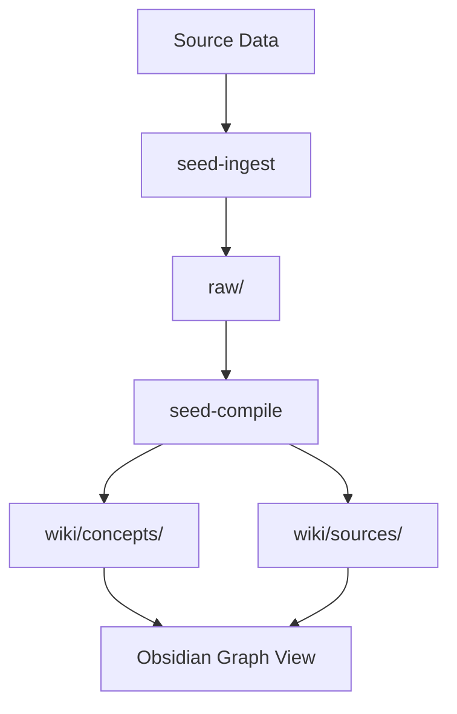

# seed-visualize — HTML Visualization Generator

You are creating a data visualization from the Seed Vault wiki. The output is:
1. A self-contained HTML file in `viz/` (opens in any browser)
2. An Obsidian wrapper `.md` in `wiki/` that embeds the viz and links it to the graph

---

## Step 1: Understand What to Visualize

Determine the visualization type from the user's request:

| Request type | Best chart type |
|-------------|-----------------|
| Quantities, comparisons | Bar chart (Chart.js) |
| Trends over time | Line chart (Chart.js) |
| Proportions, parts of whole | Pie / donut (Chart.js) |
| Two-variable relationships | Scatter plot (Chart.js) |
| Simple static chart (no interactivity needed) | SVG (inline, no library) |
| Concept relationships, network | Force-directed graph (D3.js) |
| Hierarchy, taxonomy | Tree / sunburst (D3.js) |
| Chronology, events | Timeline (vanilla HTML/CSS) |
| Process, flow | Mermaid flowchart (in markdown) |
| Geographic | Leaflet.js choropleth |

If unclear, ask: "What data would you like to visualize? I can do: bar/line/pie charts, network graphs, timelines, flowcharts, or hierarchies."

**Theme**: Ask the user (or infer from context) whether they prefer **dark** or **light** theme. Default to dark. The templates below include both theme variants — use the appropriate one.

---

## Step 2: Extract the Data

Read the relevant wiki articles and source summaries.

Pull out the data points needed:
- For **charts**: extract numerical data, categories, time series
- For **networks**: extract entity names and relationships (what links to what)
- For **timelines**: extract dates and events
- For **hierarchies**: extract parent-child relationships

If data is implicit (e.g., "visualize connections between concepts"), derive it programmatically: read all wiki files, extract `[[wikilinks]]`, build an adjacency list.

---

## Step 3: Generate the HTML

Create `viz/{{name}}.html` as a fully self-contained file.

### Chart.js template (bar/line/pie/scatter) — dark theme:

```html
<!DOCTYPE html>
<html lang="en">
<head>
<meta charset="UTF-8">
<meta name="viewport" content="width=device-width, initial-scale=1.0">
<title>{{Chart Title}}</title>
<script src="https://cdn.jsdelivr.net/npm/chart.js@4/dist/chart.umd.min.js"></script>
<style>
  body { font-family: -apple-system, BlinkMacSystemFont, 'Segoe UI', sans-serif;
         background: #1e1e2e; color: #cdd6f4; margin: 0; padding: 20px; }
  .container { max-width: 900px; margin: 0 auto; }
  h1 { font-size: 1.4rem; color: #89b4fa; margin-bottom: 4px; }
  .subtitle { font-size: 0.85rem; color: #6c7086; margin-bottom: 24px; }
  canvas { background: #181825; border-radius: 8px; padding: 16px; }
  .source { font-size: 0.75rem; color: #585b70; margin-top: 12px; }
</style>
</head>
<body>
<div class="container">
  <h1>{{Chart Title}}</h1>
  <p class="subtitle">{{Subtitle / description}}</p>
  <canvas id="chart"></canvas>
  <p class="source">Sources: {{source list}}</p>
</div>
<script>
const ctx = document.getElementById('chart').getContext('2d');
new Chart(ctx, {
  type: '{{bar|line|pie|scatter}}',
  data: {
    labels: [{{labels}}],
    datasets: [{
      label: '{{dataset label}}',
      data: [{{data}}],
      backgroundColor: [
        'rgba(137, 180, 250, 0.8)',
        'rgba(166, 227, 161, 0.8)',
        'rgba(243, 139, 168, 0.8)',
        'rgba(250, 179, 135, 0.8)',
        'rgba(203, 166, 247, 0.8)',
        'rgba(148, 226, 213, 0.8)'
      ],
      borderColor: 'rgba(255,255,255,0.1)',
      borderWidth: 1
    }]
  },
  options: {
    responsive: true,
    plugins: {
      legend: { labels: { color: '#cdd6f4' } },
      title: { display: false }
    },
    scales: {
      x: { ticks: { color: '#a6adc8' }, grid: { color: 'rgba(255,255,255,0.05)' } },
      y: { ticks: { color: '#a6adc8' }, grid: { color: 'rgba(255,255,255,0.05)' } }
    }
  }
});
</script>
</body>
</html>
```

### Chart.js template — light theme:

```html
<!DOCTYPE html>
<html lang="en">
<head>
<meta charset="UTF-8">
<meta name="viewport" content="width=device-width, initial-scale=1.0">
<title>{{Chart Title}}</title>
<script src="https://cdn.jsdelivr.net/npm/chart.js@4/dist/chart.umd.min.js"></script>
<style>
  body { font-family: -apple-system, BlinkMacSystemFont, 'Segoe UI', sans-serif;
         background: #ffffff; color: #1a1a2e; margin: 0; padding: 20px; }
  .container { max-width: 900px; margin: 0 auto; }
  h1 { font-size: 1.4rem; color: #2563eb; margin-bottom: 4px; }
  .subtitle { font-size: 0.85rem; color: #6b7280; margin-bottom: 24px; }
  canvas { background: #f9fafb; border-radius: 8px; padding: 16px; border: 1px solid #e5e7eb; }
  .source { font-size: 0.75rem; color: #9ca3af; margin-top: 12px; }
</style>
</head>
<body>
<div class="container">
  <h1>{{Chart Title}}</h1>
  <p class="subtitle">{{Subtitle / description}}</p>
  <canvas id="chart"></canvas>
  <p class="source">Sources: {{source list}}</p>
</div>
<script>
const ctx = document.getElementById('chart').getContext('2d');
new Chart(ctx, {
  type: '{{bar|line|pie|scatter}}',
  data: {
    labels: [{{labels}}],
    datasets: [{
      label: '{{dataset label}}',
      data: [{{data}}],
      backgroundColor: [
        'rgba(37, 99, 235, 0.7)',
        'rgba(16, 185, 129, 0.7)',
        'rgba(239, 68, 68, 0.7)',
        'rgba(245, 158, 11, 0.7)',
        'rgba(139, 92, 246, 0.7)',
        'rgba(20, 184, 166, 0.7)'
      ],
      borderColor: 'rgba(0,0,0,0.1)',
      borderWidth: 1
    }]
  },
  options: {
    responsive: true,
    plugins: {
      legend: { labels: { color: '#374151' } }
    },
    scales: {
      x: { ticks: { color: '#6b7280' }, grid: { color: 'rgba(0,0,0,0.05)' } },
      y: { ticks: { color: '#6b7280' }, grid: { color: 'rgba(0,0,0,0.05)' } }
    }
  }
});
</script>
</body>
</html>
```

---

### D3.js Force-Directed Network template (for concept relationship graphs):

```html
<!DOCTYPE html>
<html lang="en">
<head>
<meta charset="UTF-8">
<title>{{Title}}</title>
<script src="https://cdn.jsdelivr.net/npm/d3@7/dist/d3.min.js"></script>
<style>
  body { background: #1e1e2e; margin: 0; overflow: hidden; }
  svg { width: 100vw; height: 100vh; }
  .node circle { stroke: #45475a; stroke-width: 1.5px; cursor: pointer; }
  .node text { font-size: 11px; fill: #cdd6f4; pointer-events: none; }
  .link { stroke: #45475a; stroke-opacity: 0.6; }
  .concept { fill: #89b4fa; }
  .topic { fill: #cba6f7; }
  .source { fill: #a6e3a1; }
  .tooltip { position: absolute; background: #313244; color: #cdd6f4;
             padding: 8px 12px; border-radius: 6px; font-size: 12px;
             pointer-events: none; opacity: 0; transition: opacity 0.2s; }
</style>
</head>
<body>
<div class="tooltip" id="tooltip"></div>
<svg id="graph"></svg>
<script>
const nodes = [
  {{// {id: "Concept Name", group: "concept|topic|source", description: "..."}}}
];
const links = [
  {{// {source: "Concept A", target: "Concept B"}}}
];

const width = window.innerWidth, height = window.innerHeight;
const svg = d3.select('#graph');
const tooltip = d3.select('#tooltip');

const simulation = d3.forceSimulation(nodes)
  .force('link', d3.forceLink(links).id(d => d.id).distance(80))
  .force('charge', d3.forceManyBody().strength(-200))
  .force('center', d3.forceCenter(width/2, height/2));

const link = svg.append('g').selectAll('line')
  .data(links).join('line').attr('class', 'link');

const node = svg.append('g').selectAll('g')
  .data(nodes).join('g').attr('class', 'node')
  .call(d3.drag()
    .on('start', (e,d) => { if (!e.active) simulation.alphaTarget(0.3).restart(); d.fx=d.x; d.fy=d.y; })
    .on('drag', (e,d) => { d.fx=e.x; d.fy=e.y; })
    .on('end', (e,d) => { if (!e.active) simulation.alphaTarget(0); d.fx=null; d.fy=null; }));

node.append('circle').attr('r', 8).attr('class', d => d.group)
  .on('mouseover', (e,d) => { tooltip.style('opacity',1).html(`<b>${d.id}</b><br>${d.description||''}`).style('left',e.pageX+12+'px').style('top',e.pageY-10+'px'); })
  .on('mouseout', () => tooltip.style('opacity', 0));

node.append('text').text(d => d.id).attr('x', 12).attr('dy', '0.35em');

simulation.on('tick', () => {
  link.attr('x1',d=>d.source.x).attr('y1',d=>d.source.y).attr('x2',d=>d.target.x).attr('y2',d=>d.target.y);
  node.attr('transform', d => `translate(${d.x},${d.y})`);
});
</script>
</body>
</html>
```

### Mermaid (for flowcharts — renders natively in Obsidian):

For process flows and simple diagrams, use Obsidian's native Mermaid support in the wrapper `.md` file instead of a separate HTML file:

````markdown

````

---

## Step 4: Create the Obsidian Wrapper Page

Write `wiki/concepts/viz-{{name}}.md` (or `wiki/topics/viz-{{name}}.md` if it's a topic-level viz):

```markdown
---
title: "Viz: {{Title}}"
type: visualization
created: {{today}}
updated: {{today}}
sources: [{{wikilinks to source articles}}]
tags: [visualization, {{topic-tags}}]
status: draft
viz_file: "viz/{{name}}.html"
---

# {{Title}}

## Visualization

<iframe src="../../viz/{{name}}.html" width="100%" height="550px" frameborder="0" style="border-radius:8px;"></iframe>

> **Can't see the visualization?** Open `viz/{{name}}.html` in a browser, or install the [Obsidian HTML Reader](https://github.com/) community plugin.
> 
> Alternatively, enable iframes in Obsidian settings: Settings → Editor → Strict line breaks (off).

## What This Shows
{{1–2 paragraph explanation of what the visualization displays and how to read it}}

## Key Insights
- {{Insight 1 from the data}}
- {{Insight 2}}
- {{Insight 3}}

## Data Sources
{{list of wiki articles and raw sources the data came from}}
- [[Concept Name]]
- [[Summary: Source Title]]

## See Also
- [[Related Concept]]
- [[Topic: Parent Topic]]
```

---

## Step 5: Update Index and Catalog

Add to `wiki/_index.md` under `## Visualizations`:
```
- [[Viz: {{Title}}]] — {{one-line description of what's visualized}}
```

Add to `wiki/_catalog.md`:
```markdown
### [[Viz: {{Title}}]]
Type: visualization
Tags: visualization, {{tags}}
Summary: {{2–3 sentences: what data is shown, what type of chart, what insight it reveals}}.
```

---

## Naming Conventions

- `viz/concept-bar-chart.html` — bar chart of concept data
- `viz/wiki-network-graph.html` — full wiki link network
- `viz/topic-timeline.html` — chronological events
- `wiki/concepts/viz-concept-bar-chart.md` — wrapper page

---

## Notes on Obsidian HTML Rendering

Obsidian's built-in renderer does not show `<iframe>` tags by default. Options for users:
1. **Community plugin**: "HTML Reader" or "Webpage Export" plugins allow HTML preview
2. **Open externally**: Click the viz file in Obsidian's file explorer to open in browser
3. **Mermaid**: For diagrams that don't need custom data, use Mermaid directly in the .md file — renders natively in Obsidian without plugins

Always include the fallback note in the wrapper page so users know how to view the viz.
